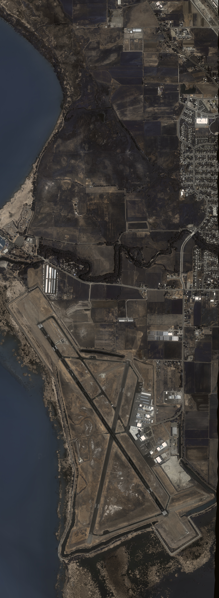
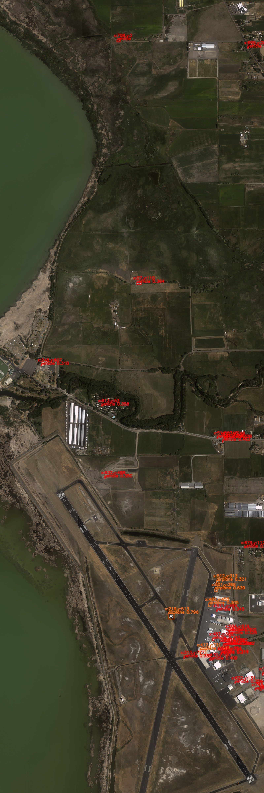
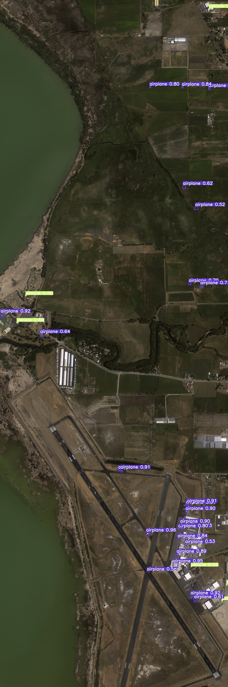

# Google-earth-Object-Recognition
Object recognition in satellite images (Dior Dataset) using RetinaNet and YoloV5

Code for training and evaluating on Dior Dataset (Google Earth Images) using RetinaNet and YOLOV5

    
     
    <em>GT image</em>

    
     
    <em>Detections on RetinaNet</em>

    
     
    <em>Detections on YOLOV5</em>

